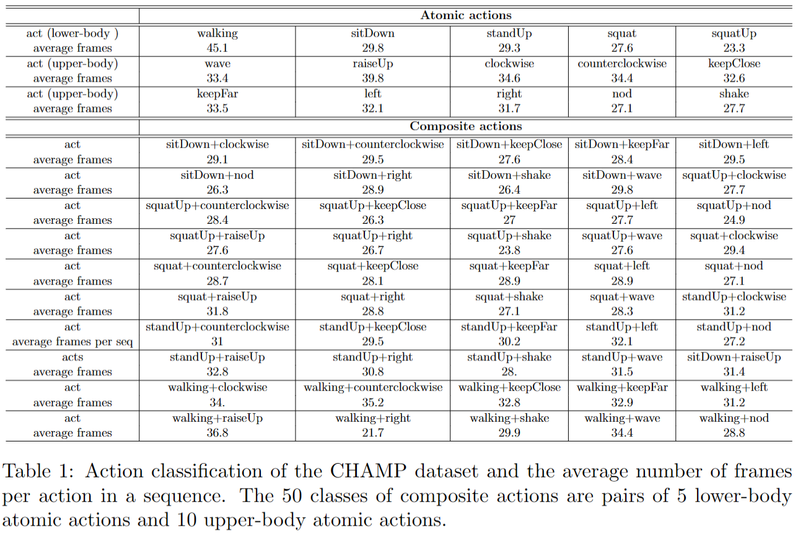
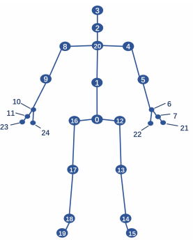

## CHAMP: A Large-Scale Dataset for Skeleton-based Composite HumAn Motion Prediction


### Dependencies

* cuda 11.4
* Python 3.8
* [Pytorch](https://github.com/pytorch/pytorch) >1.11.0 

### the CHAMP dataset
CHAMP Dataset is a large-scale dataset for composite human motion prediction performed by 22 subjects. It is recorded in
a multimedia studio equipped with Microsoft Kinect V2 cameras. 

We have 66 pose classes in total, which are divided into two groups (atomic actions and composite actions). In detail, 
there are 16 atomic actions, including 10 upper body actions (raise up, nod, wave, etc.), 5 lower body actions (sit down,
squat, walking, etc.), and a still state action. The 50 composite actions are the pairwise combination of atomic actions.


      
    
    
    
    
    
    
    
    
    

###Dataset structure: 
In this evaluation, we use 15 classes of atomic actions and 40 classes of composite actions.

Training data includes 15 classes of atomic actions performed by 21 subjects, where the labels are specified as: 
'still', 'sitDown', 'standUp', 'squat', 'squatUp',
'still_raiseUp', 'still_clockwise', 'still_counterclockwise', 'still_keepClose', 'still_keepFar',
'still_left', 'still_right', 'still_nod', 'still_shake', 'still_wave',

Validation data contains 40 classes of composite actions combined by 15 atomic actions, which are performed by subjects 2, 4, 6, 8, 10, 12, 14, 16, 18, 20, and 22.

Test data includes 40 classes of composite actions performed by subjects 1, 3, 5, 7, 9, 11, 13, 15, 17, 19, and 21 as well as 15 classes
of atomic actions performed by subject 2.


Configuration of 25 body joints in CHAMP dataset. The labels are: 
0-SpineBase 1-SpineMid 2- Neck 3-Head 4-ShoulderLeft 5-ElbowLeft 6-WristLeft 7-HandLeft 
8-ShoulderRight 9-ElbowRight 10-WristRight 11-HandRight 12-HipLeft 13-KneeLeft 14-AnkleLeft
15-FootLeft 16-HipRight 17-KneeRight 18-AnkleRight 19-FootRight 20-SpineShoulder 21-HandTipLeft
22-ThumbLeft 23-HandTipRight 24-ThumbRight



The CHAMP dataset used in this evaluationis is in ./datasets directory.


### Training
All the running args are defined in [opt.py](utils/opt.py). We use following commands to train on different datasets and representations.
To train,
```bash
python main_CHAMP.py --kernel_size 10 --dct_n 20 --input_n 20 --output_n 10 --skip_rate 1 --batch_size 32 --test_batch_size 32 --in_features 72 --exp test
```

### Evaluation
To evaluate the pretrained model,
```bash
python main_eval_CHAMP.py --is_eval --kernel_size 10 --dct_n 20 --input_n 20 --output_n 10 --skip_rate 1 --batch_size 32 --test_batch_size 32 --in_features 72 --d_model 256 --num_stage 12 --ckpt ./checkpoint/test/
```


### Acknowledgments
The overall code framework (dataloading, training, testing etc.) and predictor model code is adapted from [HisRepItSelf](https://github.com/wei-mao-2019/HisRepItself). 


